# Skills-Building Activity

In this exercise, you will work on developing the basic skills, techniques, and tools to help you create more memorable Sketchnotes. If you have any questions or get stuck as you work through this, please ask your instructor for assistance.  Have fun!

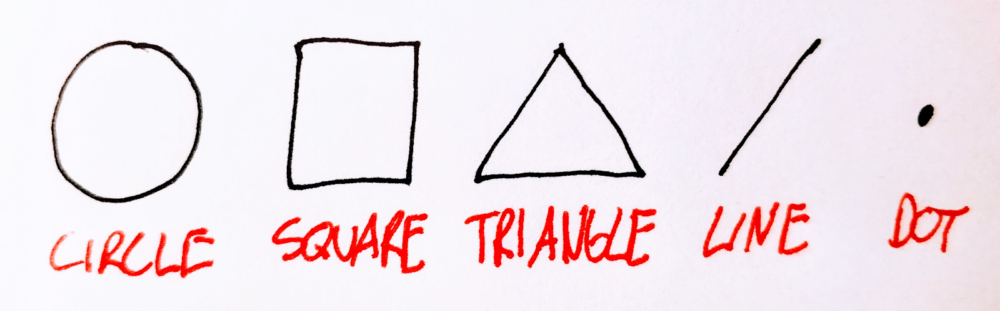

1.  Practice drawing 5 Basic elements:
    -   On a clean sheet of paper draw the 5 basic elements across the top two or three times. Speed is more important than beauty when sketchnoting!
    
    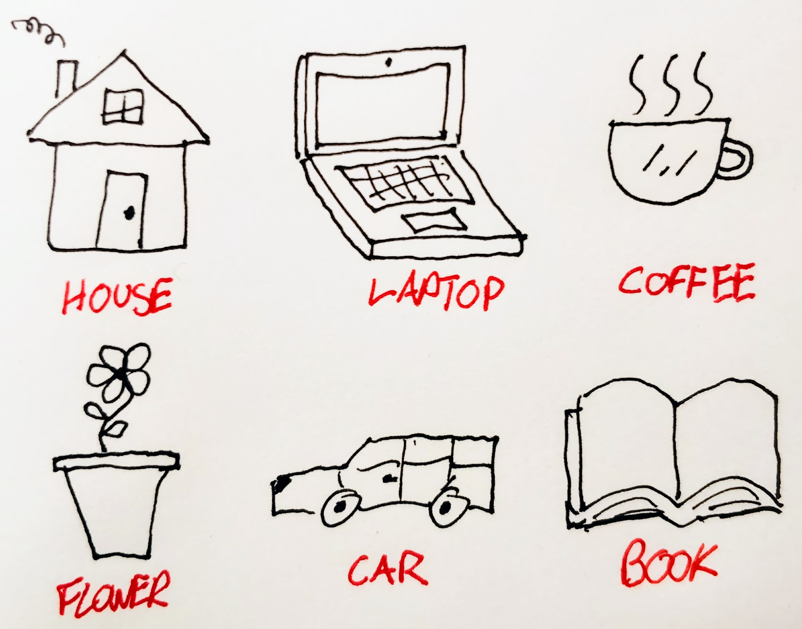
    
    -   Using those basic shapes draw of each of the following items 5 times (for a total of 35 drawings): House, Laptops, Coffee cup, Flower, Book. Don’t worry about the detail, just draw quickly, over and over! :-)
    -   Once you realize how all the objects around you are made from these 5 elements, it becomes much easier to draw all sorts of things.
    
    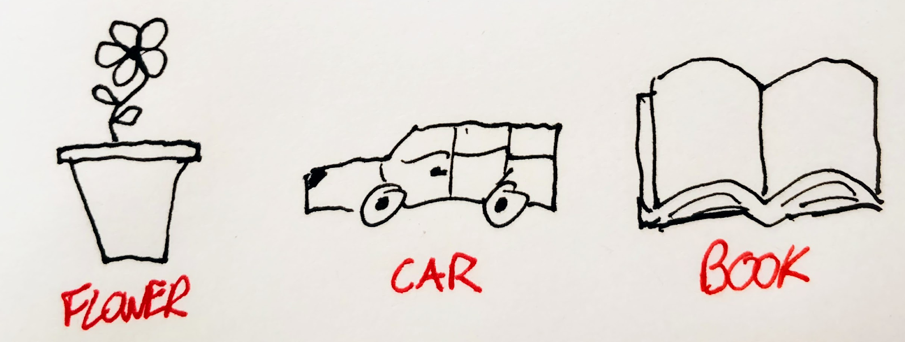
    
    -   Note: Google image search is a great place to look for inspiration when you’re drawing something new. For example, Google, “brain drawing”, and then click on the images tab.
    
    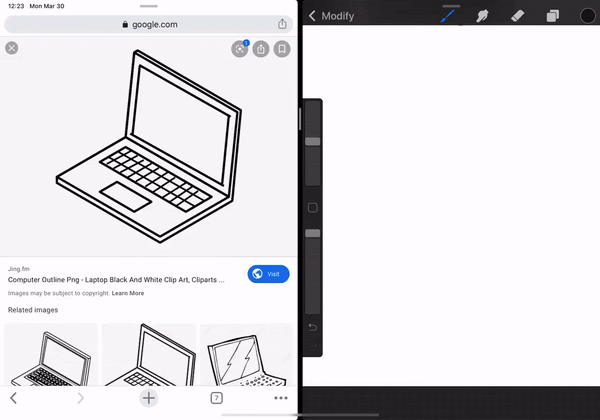
    
    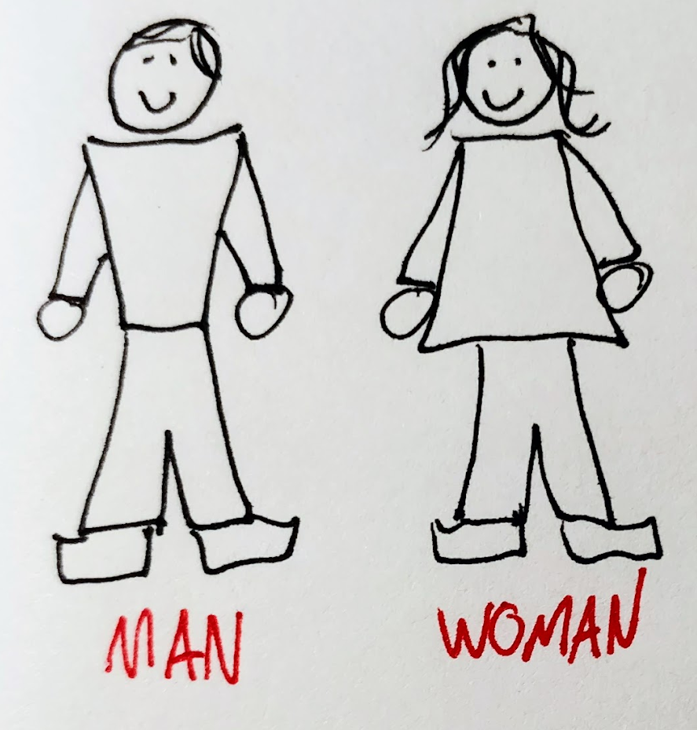
    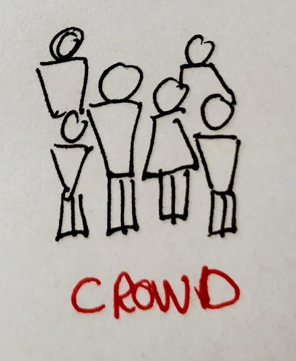
    
2.  Practice drawing people (stick people).
    -   On a clean sheet of paper draw each of the following 5 times: Man standing, Woman standing, A crowd of people.
    -   Again, Google image search is a great place to look for inspiration when drawing your stick figures, especially if you are depicting them doing something active.

    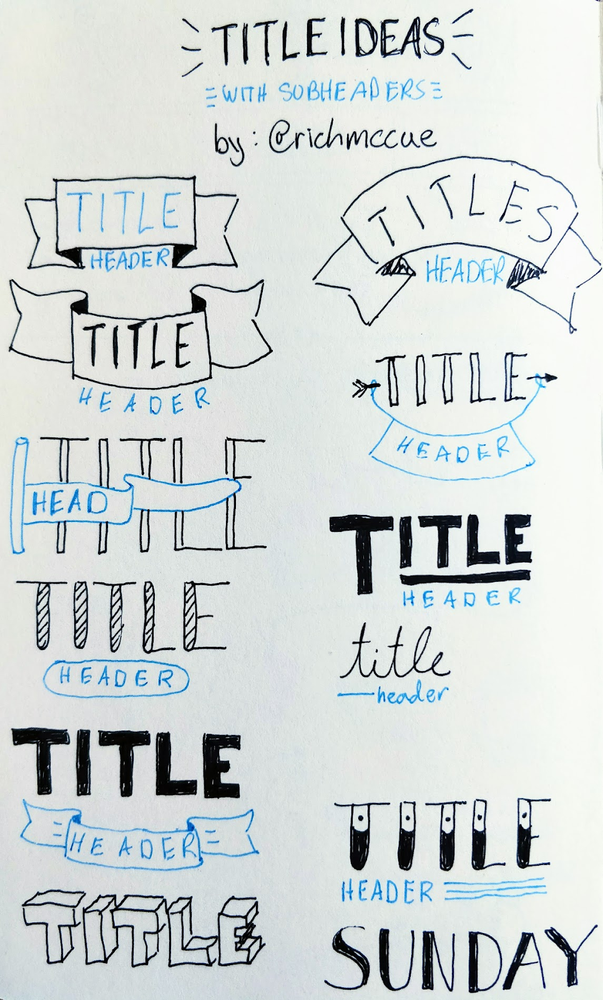

3.  Practice drawing type & text. The titles on the right are for inspiration.
    -   Draw “Library” or some other word using Block letters.
    
    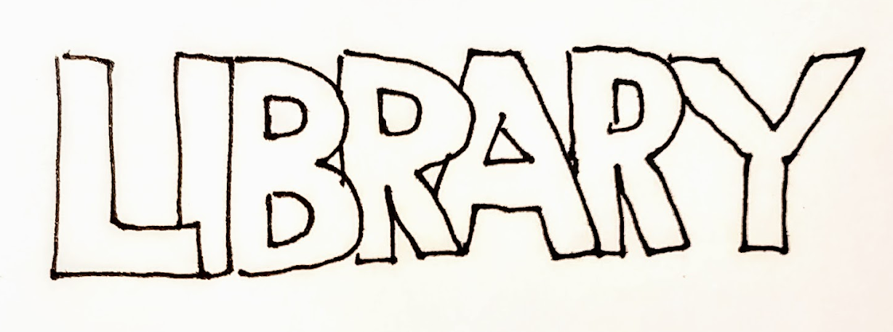
    
    -   Draw “Library” or some other word using tall skinny letters.

    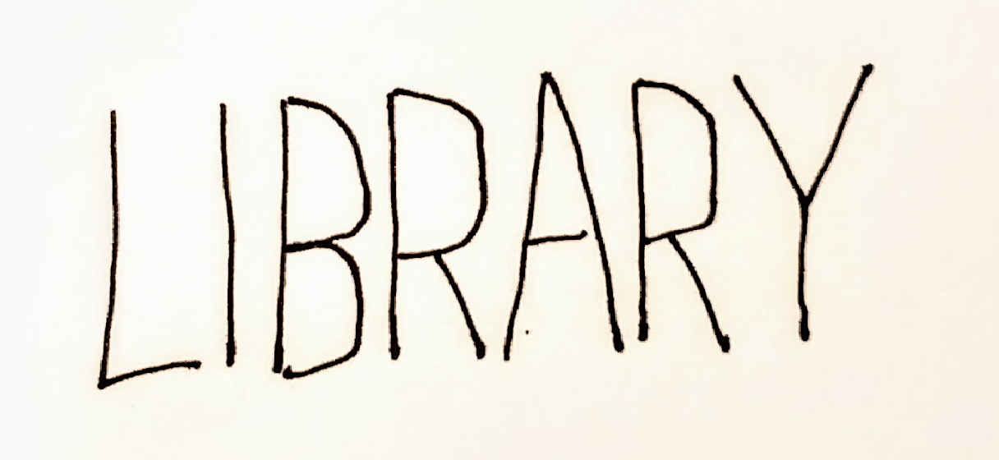

    -   Draw “Library” or some other word using the lettering style below.

    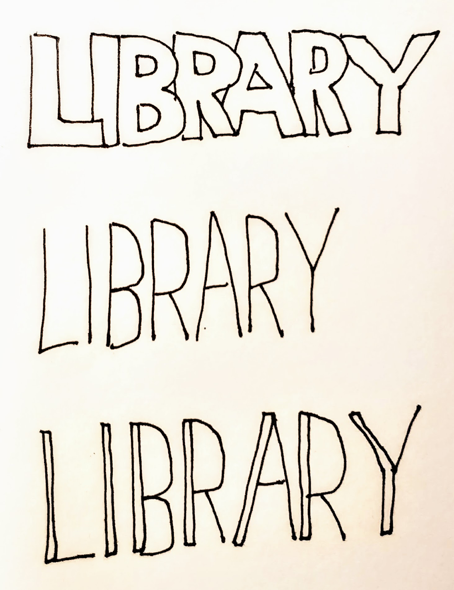
    
    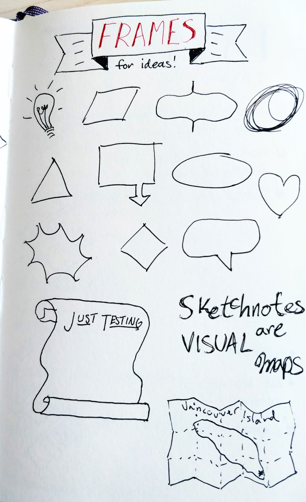

4.  Drawing some (not all) visual elements including connectors: Draw two different types of connecting lines (below), and two frames (on the right). Repeat several times. Remember that speed is more important than beauty!

    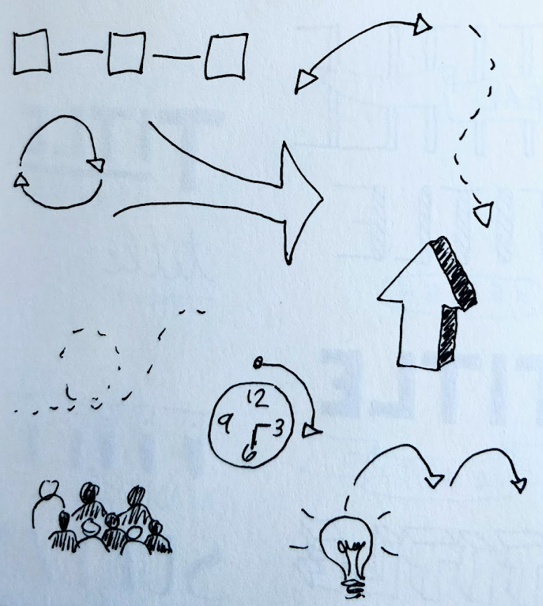

5.  Drawing metaphors:
    -   Draw a metaphor for an idea. Practice three times.
    -   Draw a metaphor for balance. Practice three times.
    
    

[NEXT STEP: Sketchnote Activity](act-2.html){: .btn .btn-blue }
