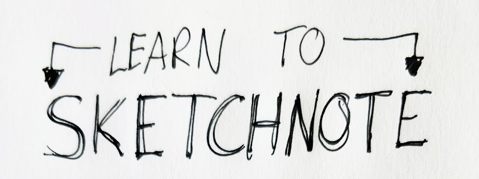
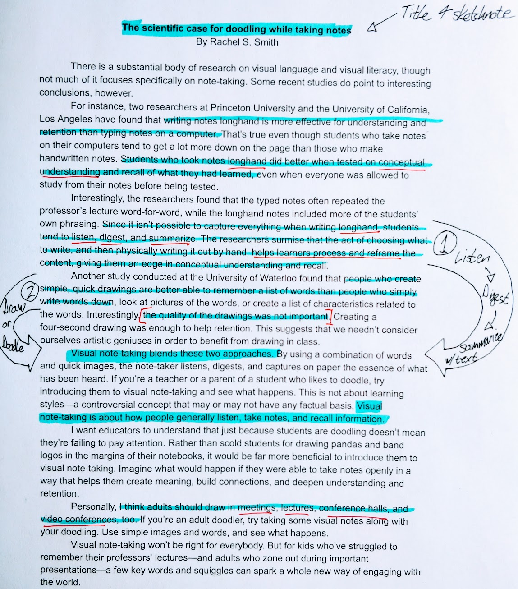
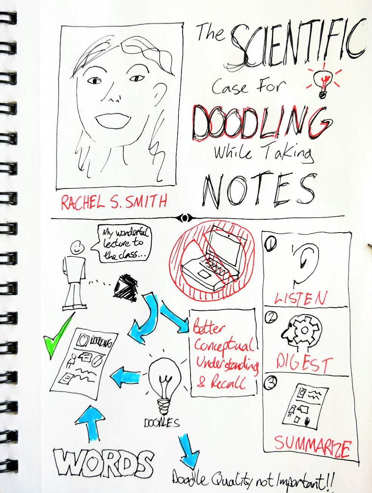

# Sketchnote Activity about Sketchnoting ;-)

*UNDER ACTIVE DEVELOPMENT*

In this exercise, you will work through creating a sketchnote based on a short journal article. If you have any questions or get stuck as you work through this, please ask your instructor for assistance.  Have fun!

1.  Gather your tools: Notebook (or several sheets of paper), a pen (or two of different colours), and a highlighter.
2.  Skim through the provided [journal article](journal-article.html){:target="_blank"} and then go back and read through it, highlighting key concepts and important information. If you have your own article you’d like to sketchnote, please do the same with your own.
3.  Research the author (or presenter). In the case of the provided article, Rachel S. Smith is the author. Find a picture of her to use for the title block of your sketchnote. I found her picture by doing a Google image search of: “Rachel S. Smith TED talk.”

    

4.  Create a title for your sketchnote including a line drawing of the author: “The scientific case for doodling while taking notes.”

    

5.  Sketchnote the main concepts and information, using a format or layout that you’ve decided to use. See tip #4 in the sketchnote on page 1 of this handout for inspiration.
6.  Take a picture of your sketchnote and please share it with us: [dscommons@uvic.ca](mailto:dscommons@uvic.ca){:target="_blank"}
Please let us know if you’d like us to keep your sketchnote private, or if we could use it as an example for other learners (with or without attribution depending on what you’d like).

[NEXT STEP: Create another Sketchnote](act-3-wonder.html){: .btn .btn-blue }
