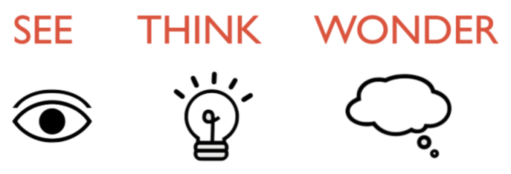
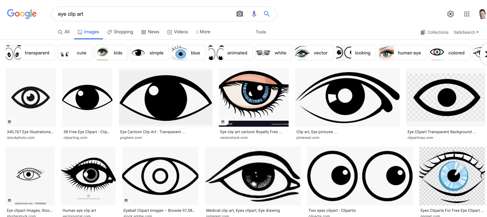

# Sketchnote Activity - See / Think / Wonder

In this exercise, you will work through creating a sketchnote based on a short about *See/Think/Wonder* activities typically used in elementary school classrooms. If you have any questions or get stuck as you work through this, please ask your instructor for assistance.  Have fun!

1.  Gather your tools: Notebook (or several sheets of paper), a pen (or two of different colours), and a highlighter.
2.  Skim through the provided [See-Think-Wonder article](see-think-wonder-article.html){:target="_blank"} (the page will open in a new browser tab) and then go back and read through it, highlighting key concepts and important information. If you have your own article you’d like to sketchnote, please do the same with your own.
3.  Create a title for your sketchnote. You might want to use something like, “See-Think-Wonder Activities: Igniting Inquiries”, but please make sure to use a title that is meaningful to you based on what were the key points of the article that stook out to you when you skimmed it.
4.  Sketchnote the main concepts and information, using a format or layout that you’ve decided to use. 
  - If you need some inspiration, please take another look at the [Sills Building handout](act-1-skills-building.html){:target="_blank"} again. 
  - Also don't forget to do Google image searches for drawing inspiration; for example if I wanted to draw a picture of any eye, I'd Google: **eye clip art**.

6.  Once you're finished your sketchnote (and it shouldn't be perfect), take a picture of your sketchnote and please share it with us: [dscommons@uvic.ca](mailto:dscommons@uvic.ca){:target="_blank"}
Please let us know if you’d like us to keep your sketchnote private, or if we could use it as an example for other learners (with or without attribution depending on what you’d like).

[NEXT STEP: Earn a Workshop Badge](informal-credentials.html){: .btn .btn-blue }
