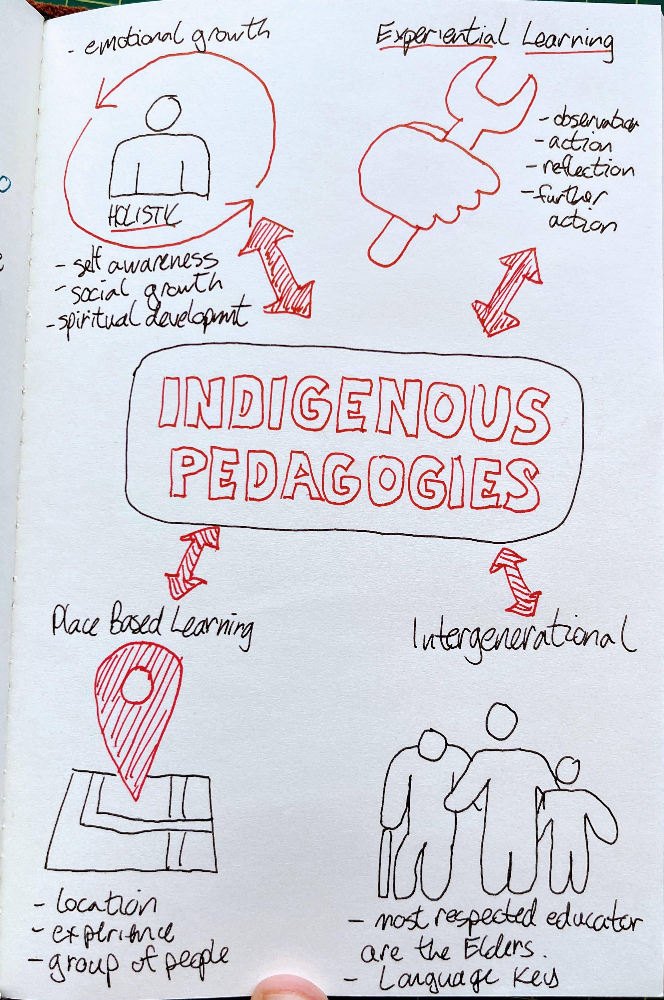

# Learn New a Language with Sketchnotes

In this exercise, you learn how to use sketchnote "scenes" to help learn new vocabulary in a language you want to learn or are actively learning. If you have any questions or get stuck as you work through this, please ask your instructor for assistance.  Have fun!

1.  Gather your tools: Notebook (or several sheets of blank paper), a pen (two of different colours if possible), and one or two highlighters. 
2.  Watch this short 4-minute video below that will introduce you to the principles underlying sketchnoting for language acquisition in general, and vocabulary building specifically:  

<iframe width="560" height="315" src="https://www.youtube.com/embed/seb4JpMVVO0?start=45" title="YouTube video player" frameborder="0" allow="accelerometer; autoplay; clipboard-write; encrypted-media; gyroscope; picture-in-picture" allowfullscreen></iframe>

4.  What kid of vocabulary would you like to learn? What language are you learning? Of course you can follow along with this tutoral and use the "camping" vocabulary in the [SENĆOŦEN language](https://www.firstvoices.com/explore/FV/sections/Data/THE%20SEN%C4%86O%C5%A6EN%20LANGUAGE/SEN%C4%86O%C5%A6EN/SEN%C4%86O%C5%A6EN){:target="_blank"}, but feel free to use a differnt vocabulary and different language as you walk through this workshop activity.
5.  Title
6.  List vocabulary
7.  Draw scene with 1 icon for each word
8.  Create a dialog box for each icon with room for the word in the language you are learning, along with a phonetic spelling so that you can more easily learn the correct pronunciation for each word.
9.  Sketchnote the main concepts and information, using a format or layout that you’ve decided to use. 
  - If you need some inspiration, please take another look at the [Sills Building handout](act-1-skills-building.html){:target="_blank"} again. 
  - Also don't forget to do Google image searches for drawing inspiration; for example if I wanted to draw a picture of any eye, I'd Google: **holistic icon** (see image below).

5.  Once you're finished your sketchnote (and it shouldn't be perfect), take a picture of your sketchnote and please share it with us: [dscommons@uvic.ca](mailto:dscommons@uvic.ca){:target="_blank"}
Please let us know if you’d like us to keep your sketchnote private, or if we could use it as an example for other learners (with or without attribution depending on what you’d like).

[NEXT STEP: Earn a Workshop Badge](informal-credentials.html){: .btn .btn-blue }
