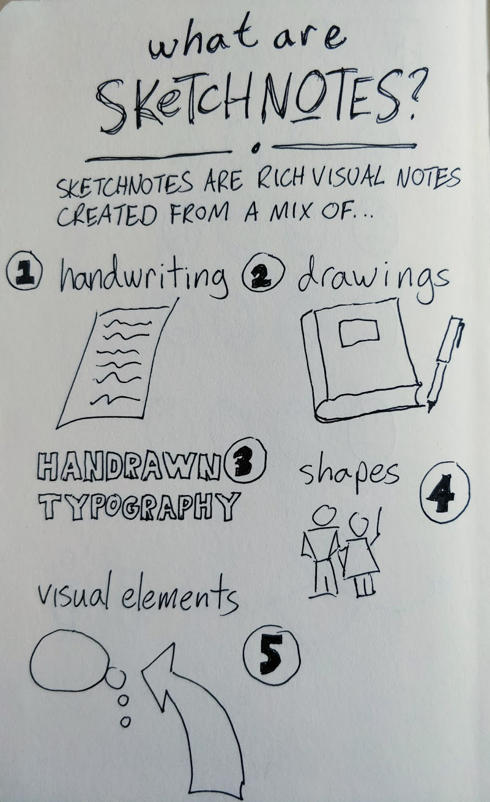

 

# Introduction to Sketchnoting: Doodle Your Way to Better Grades

- Pre-workshop activities: 15 min 
- Introductory presentation: 10 min
- Hands-on activities: 50 min

## Why Sketchnotes? 

“Sketchnotes are rich visual notes created from a mix of handwriting, drawings, hand-drawn typography, shapes, and visual elements like arrows, boxes, and lines” ([Mike Rohde, The Sketchnote Handbook](https://bit.ly/38zGkx0){:target="_blank"}).  Emergent research seems to indicate that summary note-taking, combined with relevant drawings combine to be one of the most effective ways to remember new information and create links to other related concepts and ideas. Sketchnotes can also be an effective tool to communicate complex ideas succinctly and clearly (see below). This workshop will briefly review the benefits of Sketchnoting, before working through basic Sketchnoting techniques to create a personalized Sketchnote on a provided topic or any topic chosen by a participant.

## Learning objectives

At the end of this workshop, you will be able to:

1.  Discuss the research behind sketchnoting vs laptop notes in memory recall
2.  Know that Sketchnoting DOES NOT EQUAL Artwork
3.  Understand the basic design principles of layout
4.  Understand the basic design principles of typography
5.  Use basic shapes to create a visual vocabulary for common objects, concepts, and themes
6.  Draw simple figures in a variety of poses
7.  Be able to listen, process and sketch at the same time
8.  Be aware of best practices for preparing to sketchnote a talk and/or meeting
 
[NEXT STEP: Pre-Workshop Activities](pre-workshop.html){: .btn .btn-blue }
